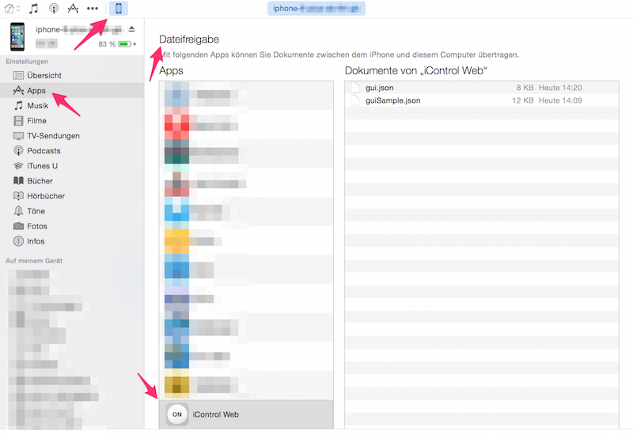

# iControl-Web Manual Pages

This github project is a manual for the "iControl Web" iOS app. The app is available for download at the Apple App Store: [https://itunes.apple.com/de/app/icontrol-web/id580659303?mt=8#](https://itunes.apple.com/de/app/icontrol-web/id580659303?mt=8# "iControl Web").

---

## Donations

I am an individual developer of the app iControl Web. My intention for it was my own need of a non-ugly app where I can send http requests for my RaspBerry Pi Home Automation System (I have also implemented a simple server for [Raspberry PI GPIO Web Control Interface](https://bitbucket.org/sbub/raspberry-pi-gpio-web-control)). Over the years I have added more features by user requests. I really appreciate donations for the app.

The app is ad free and tracker free as I would not trust any app which has control about my home. 

### Currently you can use [Paypal for Donations: https://www.paypal.me/sebastianbub/5](https://www.paypal.me/sebastianbub/5)

Thank you so much for your support of my development and motivation. It is really great to know that other people all over the world find this app useful too.

---

#### version 1.5 and higher

The app iControl Web can be used for any home automation system which supports http. The app can also be used to use ITFFF from Apple watch. You can call any URL with an appropriate sized button on any of your devices (iPhone, iPad or Apple Watch). The screens can be configured according to your needs using a json file via iTunes file sharing.

# iTunes file sharing

In order to configure the app you need create a configuration JSON file. You can always donwnload an example for a starting point using iTunes file sharing.

#### Why iTunes file sharing?

I know that it is really a bit of a hassle, but I think it is much easier to fiddle about these cryptic home automation URLs on a computer with a real keyboard instead on an iPhone. Tool support (JSON editors) is great and you probably do not change your configuration every day. If you can think of any other good possibility to create the UI including the URLs, please let me know.

## Instructions

* Install the app on your device.
* Connect the device to iTunes.
* Find the screen file sharing folder of iControl Web. 
* Drag and drop guiSample.json to your computer.
* Copy the file to the name gui.json.
* Edit the file gui.json with a JSON Editor to avoid syntax errors. There are plenty in the Mac App Store or available online.
* After you have changed the file to your needs, drag and drop it back to the iTunes file sharing folder in iTunes.
* Kill the app using the app switcher and start it again. You will see the configuration on your iPhone or iPad.
* The configuration is transferred automatically to the Apple watch. The iPhone app will show an info alert about the successful transfer.
* If you do not see an info alert, you can swipe left to the right most screen. It is an info screen where you can force the transfer of the watch configuration  again.

# JSON configuration in Detail

## General Structure

The following example shows the general structure of the JSON file. It consists of two parts. The first part `"pages"` is for the **iPhone/iPad** configuration. The second part `"pagesWatch"` is for the **Apple watch**.

On the **iPhone/iPad** screens are reachable by swiping horizontally. The last screen is a info screen. It can be disabled by settings `"showInfoScreen": false`. This should only be done after you have done all other configuration and when you are sure that everything is working.

Each page has a `"pageLabel"` which is optional. You can specify a request `"timeout"` (in seconds). The default value is 2.0 seconds. You can modify the vertical spacing of the controls with `"compactHeight"` flag in order to fit more buttons on one screen. Furthermore a page/screen has an array of `"controls"` (see details about it below).

On the **Apple watch** screens are reachable via table drill down (as it is commonly used in other apps, i.e. in Apple settings app). On the watch you can only specify one request `"timeout"` for all controls. You can configure if you want haptic feedback whenever you press a button with the flag `"hapticNetworkResponseFeedback"`. If you want to use the glance for iControl Web, you may specify a request which can be more seen as a sensor with `"glanceTextUrl"`. If the seonsor request fails, the `"glanceErrorText"` is displayed. If you want to use the glance, but you do **not** have an appropriate sensor, simply write something *wrong* to `"glanceTextUrl"`, i.e. "glanceTextUrl": "xxxhttp://www.irtp.de/test.txt". No network request is send out and the `"glanceErrorText"` is displayed directly. The glance can still be used as a shortcut to open the app.

A page/screen has a `"pageLabel"` which is displayed in the first line. Although the `"controls"` object is an array, there is only one page/screen on the watch (and the array must consist of one object), but a page can have subpages. 

On every page and subpage, it is possible to define up to four context menu items individually. A context menu entry must have a text `"contextMenuLabel1"` (count the number up to `"contextMenuLabel4"`), a `"contextMenuCmd1"` and a `"contextMenuIcon1"`. The names of the icons are predefined by Apple as [WKMenuItemIcon](https://developer.apple.com/library/ios/documentation/WatchKit/Reference/WKInterfaceController_class/#//apple_ref/c/tdef/WKMenuItemIcon). Simply use the short strings (i.e. Accept, Play, Pause, More, ...).

    General Structure of the JSON file:
    
    {
      "showInfoScreen": true,
      "pages": [
        {
          "pageLabel": "General",
          "timeout": 2,
          "compactHeight": false,
          "controls": [
            {
              "_comment": "This is the first screen."
            }
          ]
        },
        {
          "pageLabel": "TV",
          "timeout": 2,
          "compactHeight": false,
          "controls": [
            {
              "_comment": "This is a second screen (scroll horizontally)."
            }
          ]
        }
      ],
      "pagesWatch": [
        {
          "timeout": 2,
          "hapticNetworkResponseFeedback": true,
          "glanceTextUrl": "http://www.irtp.de/test.txt",
          "glanceErrorText": "Status not available",
          "pageLabel": "iControl",
          "controls": [
            {
              "contextMenuLabel1": "All Off",
              "contextMenuIcon1": "Decline",
              "contextMenuCmd1": "http://cmd1MContextAllOff"
            },
            {
              "_comment": "This is the first screen on watch."
            },
            {
              "subPageLabel": "Garage",
              "controls": [
                {
                  "_comment": "This is a sub screen (table drilldown)."
                }
              ]
            }
          ]
        }
      ]
    }

## iPhone/iPad Controls

coming soon

## Apple Watch Controls

coming soon